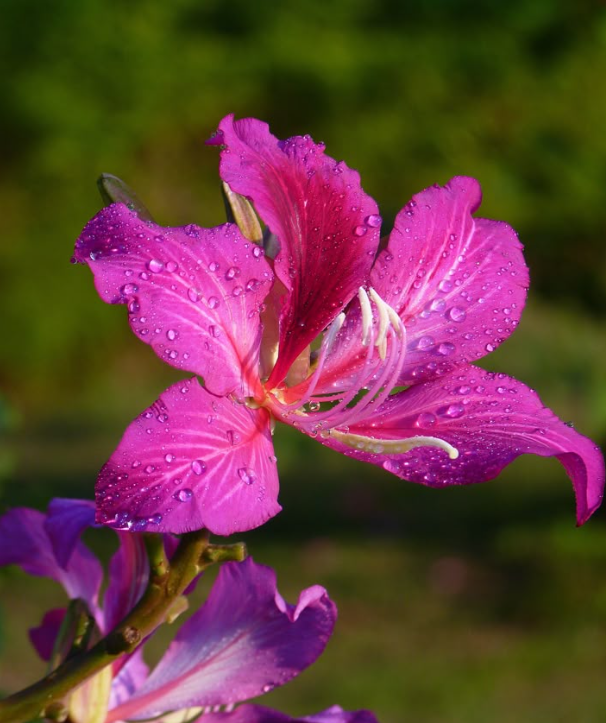
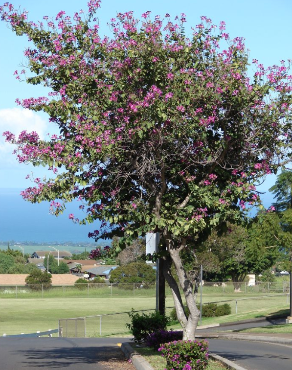

<html lang="en">
<head>
  <meta charset="UTF-8" />
  <meta name="viewport" content="width=device-width, initial-scale=1.0"/>
  <title>🌸 Bauhinia Purpurea</title>
  
</head>
<body>

  <!-- 🌸 Header with circular logo -->
  <header>
    
    

      
Bhoj Reddy Engineering College for Women

    

  </header>

  <h1>Bauhinia Purpurea</h1>

  

    
    
  

  
The <strong>Bauhinia purpurea</strong>, commonly known as the <em>Purple Orchid Tree</em> or <em>Kanchan</em>, is a beautiful flowering tree admired for its vibrant pink to purple orchid-like blossoms. Native to Southeast Asia and the Indian subcontinent, it adds color and charm to tropical landscapes.

  
<strong>Origin:</strong> Bauhinia purpurea originates from Southeast Asia, particularly from regions of India, Sri Lanka, China, and Malaysia. It is widely planted across India for its ornamental appeal and shade.

  <h2>Classification:</h2>
  
The Bauhinia purpurea belongs to the kingdom <strong>Plantae</strong>, family <strong>Fabaceae</strong>, and order <strong>Fabales</strong>. This medium-sized deciduous tree grows up to 12 meters tall and produces large, showy, purple-pink flowers that resemble orchids.

  <h2>Interesting Facts:</h2>
  <ul>
    <li><strong>Orchid-like Beauty:</strong> Its unique flowers resemble orchids, earning it the name "Orchid Tree".</li>
    <li><strong>National Symbol:</strong> The Bauhinia is the floral emblem of Hong Kong, represented in its flag and coins.</li>
    <li><strong>Fragrant Blooms:</strong> The flowers emit a gentle fragrance, especially noticeable in the early morning and evening.</li>
    <li><strong>Butterfly Magnet:</strong> The tree attracts pollinators like butterflies, bees, and hummingbirds.</li>
    <li><strong>Dual Leaves:</strong> Its distinct twin-lobed leaves resemble a heart or camel’s hoof, symbolizing unity and grace.</li>
  </ul>

  <h2>In Connection with India:</h2>
  
In India, the Bauhinia purpurea is commonly found along roadsides, in parks, and gardens. It blooms during late autumn and winter when most trees are leafless, adding striking color to the landscape. The tree is also considered sacred in certain regions and is associated with peace and harmony.

  <h2>Health & Environmental Benefits:</h2>
  <ul>
    <li><strong>Medicinal Uses:</strong> The bark, leaves, and flower buds are used in Ayurvedic medicine to treat digestive disorders, ulcers, and infections.</li>
    <li><strong>Air Purification:</strong> The tree helps absorb pollutants, purify the air, and release oxygen, contributing to a healthier environment.</li>
    <li><strong>Soil Improvement:</strong> As a leguminous plant, it fixes atmospheric nitrogen, enhancing soil fertility naturally.</li>
    <li><strong>Stress Relief:</strong> Its calming fragrance and delicate flowers help create a soothing environment in gardens and green spaces.</li>
    <li><strong>Eco-Friendly:</strong> Supports biodiversity by providing nectar and shelter for small birds and insects.</li>
    <li><strong>CO₂ Emission Note:</strong> The Bauhinia purpurea efficiently absorbs carbon dioxide during the day and releases oxygen. At night, like most plants, it releases a small amount of CO₂, which is harmless. It’s completely safe to sit or rest under this tree for long periods — its shade is pleasant, and it does not emit harmful gases.</li>
  </ul>

  <footer style="text-align: center; font-size: 8px; color: #777; margin-top: 50px;">
    <em>@Akhila Jeripothula, III CSE A</em>
  </footer>

</body>
</html>
